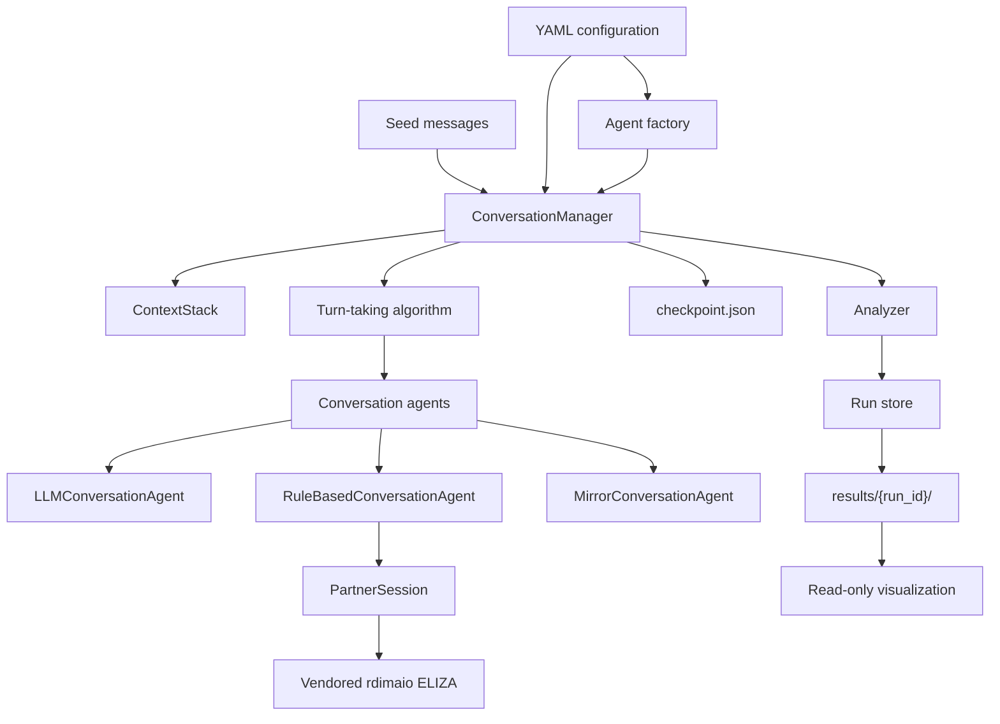
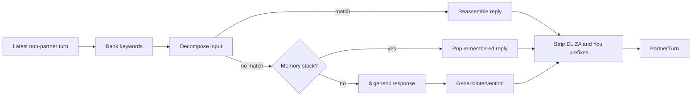

# ELIZA scaffolding architecture

babel-ai studies drift and collapse in long-running conversations. A
`ConversationManager` owns the transcript and schedules agents. ELIZA
is a deterministic participant, not an LLM prompt wrapper.

## System overview

All generated turns enter `ContextStack`. This gives each participant
the same ordered history and makes ELIZA interventions visible as normal
conversation turns.

## ELIZA response path

The vendor logic remains stock rdimaio except for the `$` hook. The
wrapper does not call rdimaio's interactive `prepare_response()`.

## Pillars

| Pillar | Scope | Architectural role |
| --- | --- | --- |
| A | LLM access | Provider adapters used by `LLMConversationAgent`. |
| B | Metrics | Flat metric schema and canonical parquet artifacts. |
| C | Web visualization | Read-only exploration of saved runs. |
| D | Repository hygiene | Removes legacy loops and stale documentation. |
| E | Conversation manager | Owns lifecycle, context, scheduling, recovery. |

The ELIZA work is coupled to E3: `RuleBasedConversationAgent` adapts a
`PartnerSession`. Pillar B persists its fallback marker. Pillar C reads
the resulting run directories without controlling experiments.

## Delivery status

E1 supplies the manager, context stack, round-robin scheduling,
analysis policies, and atomic checkpoints. E2–E4, ELIZA execution,
agent factories, run-store I/O, and canonical YAML loading remain
scaffolding or planned work.
