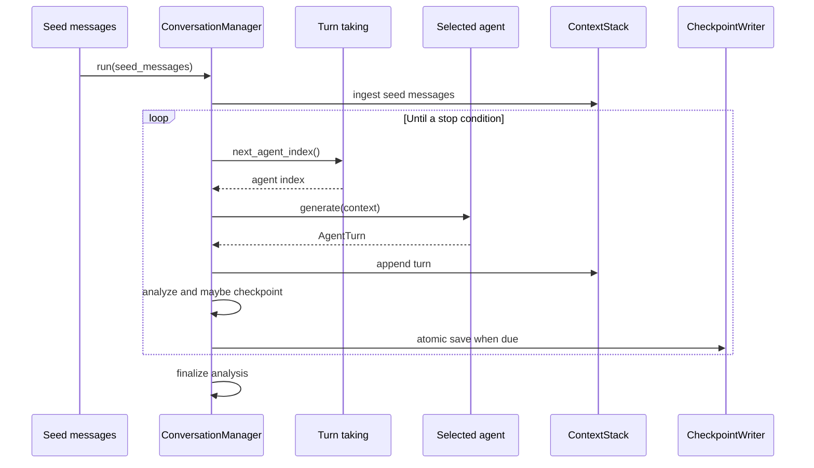

# Conversation manager

`ConversationManager` is the conversation lifecycle owner. It accepts
agents, settings, an analyzer, and a results root. Each manager creates
a config-driven run ID and writes checkpoints below that run directory.

## Loop



The loop stops when the context reaches `max_iterations` or
`max_total_characters`. Current `max_iterations` is measured against
all stack messages, including seeds.

## Agents

| Type | Adapter | Status |
| --- | --- | --- |
| `llm` | `LLMConversationAgent` wraps legacy `Agent`. | Implemented |
| `rule_based` | `RuleBasedConversationAgent` wraps ELIZA. | Implemented |
| `mirror` | `MirrorConversationAgent` echoes a peer turn. | Implemented |

Each agent returns `AgentTurn`. Its `content` becomes a
`ConversationMessage`. ELIZA turns also carry `eliza_branch`,
`eliza_keyword`, `eliza_reassembly`, and `used_generic_fallback` for
persistence and visualization.

`RuleBasedConversationAgent` builds interventions from config, including
`live_feed` with `topic_switch_probability` and `feed_sources`.

## Turn-taking

`RoundRobinTurnTaking` cycles deterministically through agent indices.
`FixedOrderTurnTaking` repeats an explicit `fixed_order` list and
rejects out-of-range indices. Both serialize their cursor through
`snapshot()` and restore it from checkpoint data.

The manager currently assigns alternating `user` and `assistant` roles
to generated turns. E2 is intended to make roles stable rather than
derived from parity.

## Analysis and checkpoints

| Policy | Manager behavior |
| --- | --- |
| `per_turn` | Analyze the newest metric after every agent turn. |
| `on_checkpoint` | Analyze at timed checkpoints and perform a final pass. |
| `at_end` | Analyze all metrics after the loop finishes. |

`CheckpointWriter` writes `checkpoint.json.tmp` and then renames it to
`checkpoint.json`. The payload contains messages, metrics, scheduling
state, pending nudge, agent states (including ELIZA memory stack),
settings, and save time.

`ConversationManager.resume_from()` restores stack, metrics, turn-taking,
and ELIZA session state from `results/{run_id}/checkpoint.json`. Continue
with `continue_run()` or:

```bash
poetry run python scripts/resume_conversation.py results/{run_id}/checkpoint.json
```

## Run naming and progress

`Experiment` assigns run directories via `persistence.run_naming`:
`{agent-slug}__{fetcher}__{turns}turns_{short_uuid}`. When wired through
`Experiment`, `TurnProgress` renders a terminal progress bar per turn.

## Integration boundary

The manager saves checkpoints during a run. `Experiment` finalizes
metrics and writes `turns.parquet`, `meta.json`, and an optional
manifest in the same run directory via `persistence.save_run()`.
