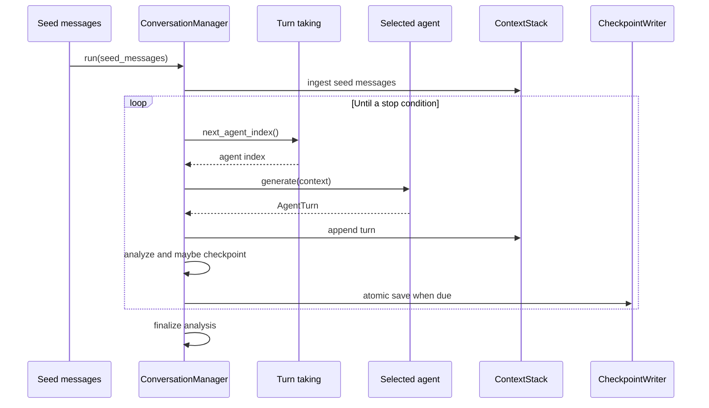

# Conversation manager

`ConversationManager` is the conversation lifecycle owner. It accepts
agents, settings, an analyzer, and a results root. Each manager creates
a UUID run ID and writes checkpoints below that run directory.

## Loop

The loop stops when the context reaches `max_iterations` or
`max_total_characters`. Current `max_iterations` is measured against
all stack messages, including seeds.

## Agents

| Type | Adapter | Status |
| --- | --- | --- |
| `llm` | `LLMConversationAgent` wraps legacy `Agent`. | Implemented |
| `rule_based` | `RuleBasedConversationAgent` wraps ELIZA. | Scaffold |
| `mirror` | `MirrorConversationAgent` echoes a peer turn. | Scaffold |

Each agent returns `AgentTurn`. Its `content` becomes a
`ConversationMessage`; `llm_nudge` and `used_generic_fallback` carry
partner-specific metadata for later persistence and scheduling work.

## Turn-taking

`RoundRobinTurnTaking` cycles deterministically through agent indices.
`FixedOrderTurnTaking` repeats an explicit `fixed_order` list and
rejects out-of-range indices. Both serialize their cursor through
`snapshot()` and restore it from checkpoint data.

The manager currently assigns alternating `user` and `assistant` roles
to generated turns. E2 is intended to make roles stable rather than
derived from parity.

## Analysis and checkpoints

| Policy | Manager behavior |
| --- | --- |
| `per_turn` | Analyze the newest metric after every agent turn. |
| `on_checkpoint` | Analyze at timed checkpoints and perform a final pass. |
| `at_end` | Analyze all metrics after the loop finishes. |

`CheckpointWriter` writes `checkpoint.json.tmp` and then renames it to
`checkpoint.json`. The payload contains messages, metrics, scheduling
state, pending nudge, settings, and save time. The reader can rebuild
the stack and state, but `ConversationManager.resume_from()` remains
unimplemented (E4).

## Integration boundary

The manager currently saves checkpoints only. Pillar B will receive
metrics at completion and write `turns.parquet`, `meta.json`, and an
optional manifest in the same run directory.
